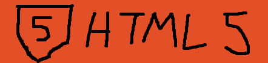

  

  

  
<strong>📠Just your local certified idiot. I program sometimes as a hobby and learn things on the fly. I do like learning new things if I can put my head to it.</strong>

  

## Languages I'm familiar with:
   

## Tools I'm familiar with:
  

_These badges are made using Paint. Feel free to use them_

